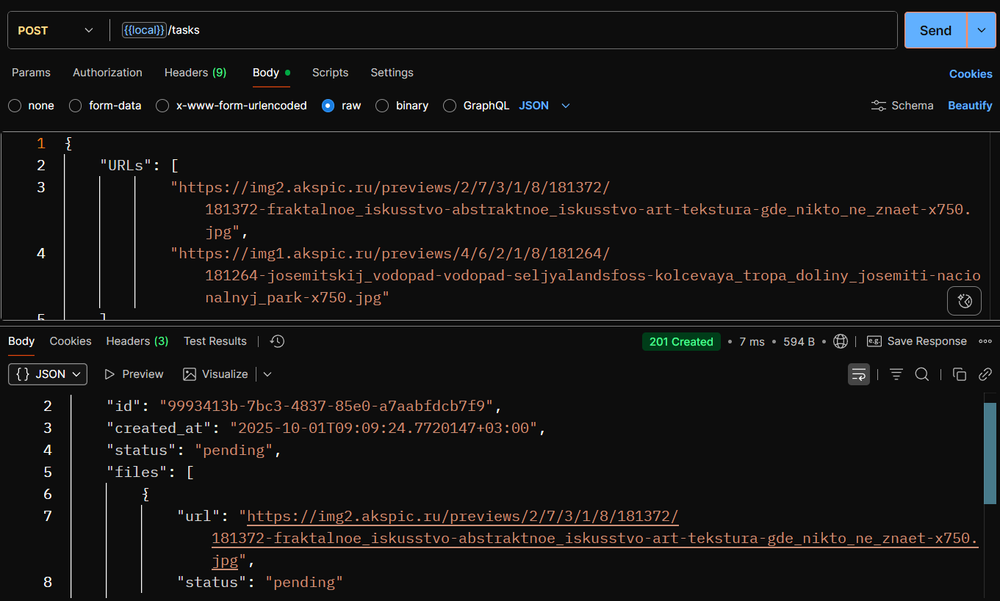
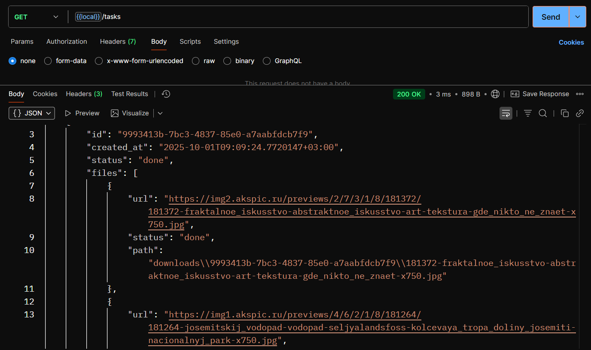
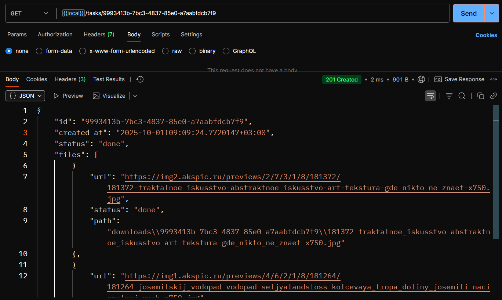
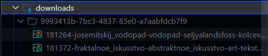

# Сервис для загрузки файлов
Позволяет создавать задачи по загрузке файлов из интернета, отслеживать статус каждой задачи и просматривать список всех задач.

## Функционал
Сервис имеет 3 эндпоинта:
- POST для создания задачи
- GET для получения статуса задачи по ее ID (path параметр)
- GET для получения списка всех задач с их статусами

Для создания задачи в эндпоинт передается список ссылко с файломи из интернета, которые нужно загрузить. В ответ пользователь получает ID новой задачи и ее статус.

Сервис **сохраняет свое состояние** при выключениях или сбоях и продолжает загрузку файлов после перезапуска.

Задачи имеют следующие состояния: 
- penging
- in_progress
- done
- failed

## Запуск
1. Склонировать репозиторий
```
git clone https://github.com/4udiwe/download-task-service
cd download-task-service
```
2. Запустить проект
```
go run cmd/main.go
```

## Реализация
Для сохранения состояния сервиса используется **storage в виде JSON-фалйа**, при первом запуске он создается автоматически.
Путь к storage файлу можно поменять в `config/config.yaml`. По умолчанию он:
    
    tempStorage/tasks.json  

При первом запуске сервиса и создании задачи в корне проекта создается папка 

    downloads

внутри которой на каждую заадчу созадается папка с именем = ID задачи. Туда складываются загруженные в рамках задачи файлы.

В проекте реализовано логирование и валидация запросов.

## Скриншоты 
Создание задачи
  

Просмотр всех задач
  

Просмотр задачи по ID
  

Отображение загруженных файлов
  